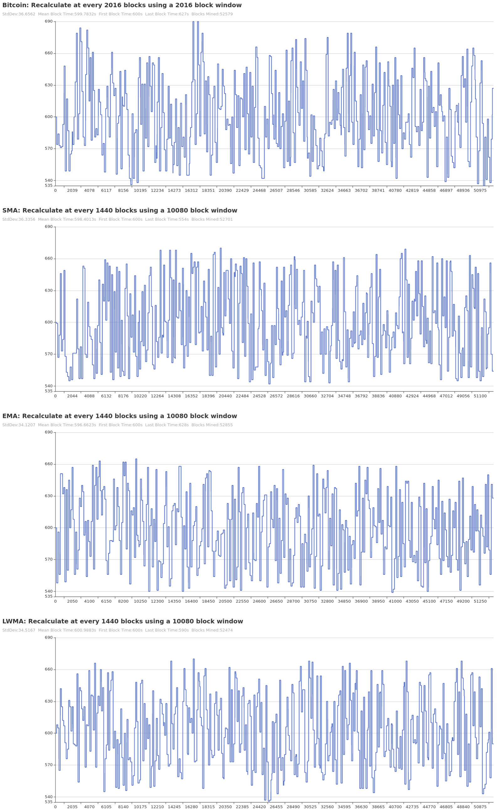

# Blockchain Difficulty Simulator

[](https://github.com/seanvaleo/dsim/actions)
[](https://goreportcard.com/report/github.com/seanvaleo/dsim)

I created this simulator to evaluate the effectiveness of various blockchain difficulty algorithms in terms of volatility and accuracy.


## 📄 Background

In a decentralized proof-of-work blockchain, where no individual controls the timing of block additions, there
must be a mechanism set in place in order to regulate the desired block frequency.

A so-called 'difficulty adjustment algorithm' can be used to adjust the difficulty of mining a new block,
based on an estimate of the network's total problem solving power. With all things being equal, the
block time should approach and maintain its target block time.

The goal of this project is to provide a simulator to report on the effectiveness of various
difficulty algorithms by observing the standard deviation, and mean values of all block intervals
after a period of days.


## 🪄 Algorithms

This project ships with examples of the following difficulty adjustment algorithms, some of which are parameterized for tuning:

- Bitcoin
- Ethereum (Homestead)
- SMA
- EMA
- LWMA

The `Bitcoin` algorithm calculates the average time taken to mine the last 2016 blocks and adjusts the difficulty every 2016 blocks accordingly. The algorithm aims to maintain a block time of 10 minutes, by using the average time, the target time, and the difficulty of the last block to adjust the difficulty of mining the next 2016 blocks.

The `Ethereum` Homestead algorithm  calculates a new difficulty value after each block is mined. It uses the difficulty value and block time of the previous block, to target a 15 second block time by establishing a 10–20 second block time window where no difficulty changes occur. It also includes logic to gradually increase difficulty every 100,000 blocks to facilitate the transition from a PoW protocol to a PoS protocol.

The `SMA` (Simple Moving Average) algorithm calculates the average time taken to mine the last X blocks, considering each block equally. The algorithm adjusts the difficulty periodically based on this average, aiming to maintain a target block time. However, since the SMA algorithm assigns the same weight to all blocks, it may not respond quickly to sudden changes in network hash rate. As a result, it can lead to a period of "lag" until the difficulty adjusts appropriately.

The `EMA` (Exponential Moving Average) algorithm calculates the average time taken to mine the last X blocks, giving more weight to recent blocks. By using an exponential smoothing factor, the algorithm should result in the difficulty adjusting quickly to changes in network hash rate. The EMA algorithm is effective at responding to sudden changes in mining power, providing a supposedly more adaptive and responsive difficulty adjustment mechanism.

The `LWMA` (Linearly Weighted Moving Average) algorithm calculates the average time taken to mine the last X blocks. However, the LWMA algorithm assigns more weight to recent blocks while decreasing the weight for older blocks in a linear fashion. This allows it to respond more quickly to changes in hash rate compared to the SMA algorithm.


## 📈 Results




## 📐 Design Decisions

1) Network power variability is expressed in terms of one value for net mining power. In the real world, network power varies due to a) miners going on/offline, and b) miners having differing computational power. The reasons for the change don't matter to us, we only care about simulating net overall change.
2) Solve time is perfectly correlated to difficulty. In the real world, even with a constant difficulty and network mining power, blocks are solved in an arbitrary amount of time, due to the probablistic nature of the typical PoW mining process. This doesn't matter to us, because on average, block solve time is highly correlated to difficulty.
3) With the default configuration, the difficulty is initialized to generate the perfect block time for the initial network mining power. As the mining power fluctuates throughout the simulation, the difficulty is adjusted per the selected algorithm. The simulator reports on the standard deviation in block generation times intervals over X blocks. If you wish to also factor in the effectiveness of an algorithm when the initial block difficulty is initially inappropriate for the mining power, that is configurable.
4) With the default configuration, the network mining power can fluctuate by up to 10% from its initial power, each day. This seems to be normal for the Bitcoin blockchain in 2023. This daily fluctation limit is configurable. 
5) The simulation will run for a period of X days, instead of X blocks, since block time will vary and we want to predict effectiveness of algorithms when run for a given period of time.
6) The highest resolution for block time is Seconds.


## 🚀 Try It Out

Install Dependencies:
- [Go](https://golang.org/doc/install)
- [Git](https://git-scm.com/download)

Build and Run:
```
git clone git@github.com:mesosoftware/blockchain-difficulty.git
cd blockchain-difficulty
go run cmd/main.go
```

Configure global settings using environment variables in the project's `.env` file. Options/defaults:
```
SIMULATION_DAYS=365
INITIAL_NETWORK_HASH_POWER=1000000
LIMIT_NETWORK_HASH_POWER_PCT_CHANGE=10
```

Configure network and algorithm parameters in `cmd/main.go` like so:
```go
// Initial Difficulty = 600000000, Target(s) = 600, Block Interval = 10, Window = 10
n := network.NewNetwork(600000000, algorithms.NewSMA(600, 10, 10))
```


## 🔬 Research

- [Difficulty Wiki](https://en.bitcoin.it/wiki/Difficulty)
- [Analysis of Difficulty Algorithms](https://github.com/zawy12/difficulty-algorithms/issues/50)
- [Why the Bitcoin target block time is 10 minutes](https://bitcoin.stackexchange.com/questions/1863/why-was-the-target-block-time-chosen-to-be-10-minutes)
- [Why the Bitcoin adjustment interval is 2 weeks](https://bitcoin.stackexchange.com/questions/65868/why-was-it-chosen-to-adjust-difficulty-every-2-weeks-rather-than-2-days-or-ever)
- [Live BTC statistics](https://siastats.info/mining)
- [LWMA algorithm](https://github.com/zawy12/difficulty-algorithms/issues/3)
- [ASERT/others](https://reference.cash/protocol/blockchain/proof-of-work/difficulty-adjustment-algorithm)
- [ETH Homestead](https://blog.cotten.io/ethereums-eip-2-4-15-second-block-target-98d4c11017e1)
- [Digishield](https://dgbwiki.com/index.php?title=DigiShield)
- [Bitcoin Proof-of-Work](https://github.com/bitcoin/bitcoin/blob/master/src/pow.cpp)
- [ETH DAA Implementation](https://github.com/ethereum/go-ethereum/blob/81d328a73e00454912edf79e74f7d041467fa2aa/consensus/ethash/difficulty.go#L82)
- [Attacks](https://old.reddit.com/r/Bitcoin/comments/mtugta/mentor_monday_april_19_2021_ask_all_your_bitcoin/gv86j6b/?context=5)
- [Selfish Mining Against Multiple DAA's](https://eprint.iacr.org/2020/094.pdf)
- [Economic Analysis of Difficulty Adjustment Algorithms](https://papers.ssrn.com/sol3/papers.cfm?abstract_id=3410460)


## ✏️ Contributing

Please feel free to contribute to the project by:
- Adding algorithms
- Fixing bugs
- Proposing new features in GitHub Issues
